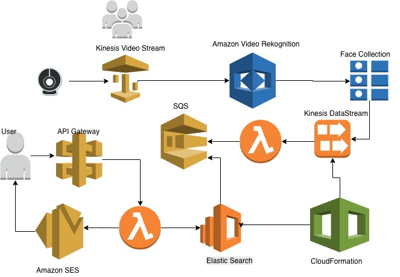
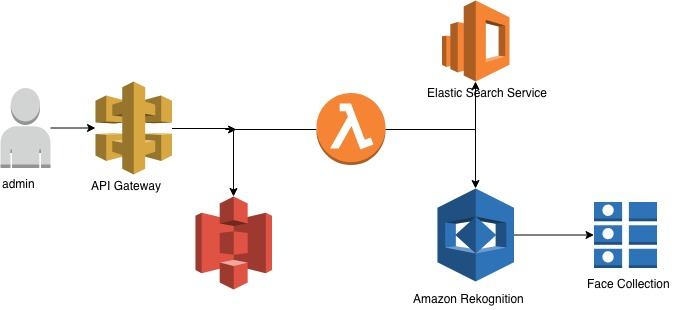

# Semblance
A Facial Recognition Application developed using AWS Services to monitor and automate existing attendance tracking systems.
AWS services used are:
CloudFormation
Kinesis Video Stream, Kinesis Data Stream
Rekognition
SNS
SQS
API Gatway
Lambda

Architecture - Monitoring Mode

Architecture -  Training Mode

